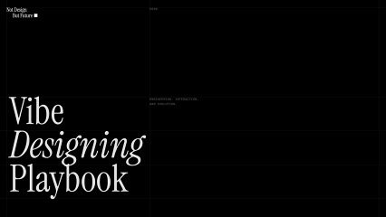
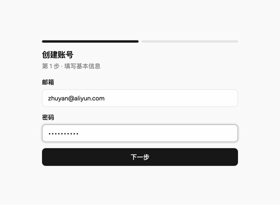

<div align="center">



<br/>

### Vibe Designing Playbook

**教会 AI 做设计的，从来不是更强的模型，而是更好的设计师。**

一份关于「设计如何进入 AI 生成系统」的实践设计指南 · 阿里云设计中心 出品

<br/>

[**📖 在线阅读 →**](https://alibaba-cloud-design.github.io/vibe-designing-playbook/)

`设计工程` · `动态交互` · `自我进化`

</div>

---

## 为什么写这本书

AI 并非不懂设计，而是它的创造力常常被「倾向」所掩盖。

当需求含糊时，模型会收敛到训练数据里最高频、最稳妥的那类结果——统一的无衬线字体、浅色背景配紫色渐变、四平八稳的布局。通用、安全，也正因此流于平庸。技术上称之为「分布收敛」：模型采样时偏向多数，而多数往往等同于平均。

真正的问题不在于模型不够强。它见过的设计远多于任何一位设计师，本就具备极致的理解力，只是被「向平均靠拢」的惯性遮蔽了。**设计师要做的，不是等一个更聪明的模型，而是把专业判断明确地建立起来、注入给它**——让它在具体业务里知道什么才算好，并沉淀为机制，稳定产出。

这本书，讲的就是怎么把这件事做成。

## 三章，一条线

作为一支长期服务 Agentic 云产品的设计团队，我们把实践拆成三层：

| | 章节 | 解决什么 |
| :-- | :-- | :-- |
| **01** | **设计工程** · Design Engineering | 把「什么是好」写成 Agent 能读取的**声明**与**契约**，让生成从碰运气变成可控——产出稳定接近明确的质量标准。 |
| **02** | **动态交互** · Dynamic Interaction | 界面不再预先画死，而是随用户的**真实意图**在运行时生成——先想清任务，再决定此刻该出现什么。 |
| **03** | **自我进化** · Self-Evolution | 让产物被持续评估、被打回重做，在 **taste** 的牵引下不断突破模型的设计能力上限。 |

贯穿三层的，是一个常被略过的事实：能把「什么是好」讲清楚的，始终是人。模型可以学会执行、复用、规模化地应用判断，但判断本身，得先由一个真正懂设计的人立起来。

## 书里有什么

不是一份静态 PDF，而是一个**可交互的阅读现场**——每一步能力都用真实产物演示，一句话如何被拆成规格、结构、组件、交互和验收，最后生成一张可交付的页面：

<div align="center">
  
  <br/>
  <sub>主链路演示：一句需求进入，沿声明与契约逐步生成可交付页面</sub>
</div>

<br/>

- **六份设计声明 + 两份执行契约** —— spec / domain / craft / design / components / template，以及 skill 与 evaluator，每一份约束链路里的一环
- **两条交付路线** —— 声明与契约直接生成 prototype，或在复杂场景下接入 Figma MCP 再回写 IDE
- **一套设计词典** —— 12 类 188 个审美词条，把「高级」「克制」这类抽象词，翻译成 Agent 能执行的表达规则

## 出品

**阿里云设计中心** · 2026

作者：**ZhuYan** · **Ailin Yu** · **Zehui Jin**

> Intent becomes form.

---

<details>
<summary>本地开发与部署</summary>

<br/>

```bash
npm install
npm run dev        # 本地预览 http://localhost:5173
npm run build      # 构建产物在 dist/
```

推送到 `main` 分支后，GitHub Actions 自动构建并发布到 GitHub Pages（见 [`.github/workflows/pages.yml`](.github/workflows/pages.yml)）。

**技术栈**：React 19 · Vite · GSAP（ScrollSmoother / ScrollTrigger）· Tailwind CSS · 自托管思源宋/黑字族

</details>
